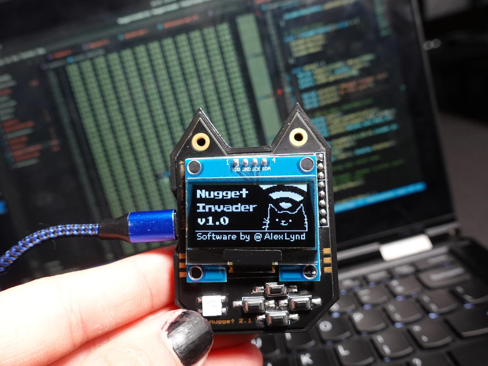

# Nugget Invader

  
   
  <b>A WiFi reconnaissance & attack toolkit for the ESP8266 based WiFi Nugget.</b>
   
   

Welcome to the Nugget Invader repository!  The Invader is a WiFi attack suite developed for the WiFi Nugget, an ESP8266 based platform designed to make it easy to learn wifi security and hardware development.  
You can find code for a simple deauthentication proof of concept under the `Deauth-POC` folder, but you'll need to use an older version of the [ESP8266 SDK](https://github.com/espressif/ESP8266_NONOS_SDK/releases/tag/v2.0.0) .

## Current Features
- High level menu interfaces / custom graphics
- Supports deauthentication attacks
- Raw promiscuous packet

## Future Features / Fixes
- Update / streamline WiFi scanner class
- Add MAC address parsing for client association
- More WiFi attacks
- Packet monitor filtering
- Cooldown time for packet monitor
